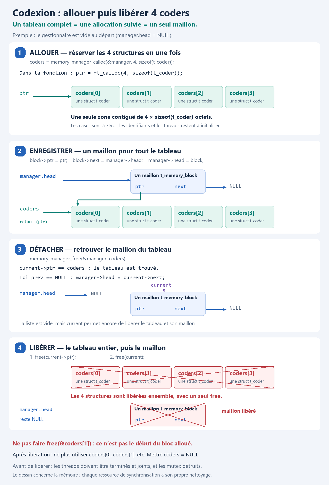

# Codexion : allocation et libération du tableau de coders



## Exemple utilisé

Le dessin suppose un gestionnaire vide et une configuration avec quatre coders. `t_coder` représente la future structure d’un coder.

```c
manager.head = NULL;
coders = memory_manager_calloc(&manager, 4, sizeof(t_coder));
```

Cet appel effectue deux allocations :

1. Un bloc contigu assez grand pour **quatre structures `t_coder`**.
2. Un unique maillon `t_memory_block` pour enregistrer l’adresse de ce bloc.

**Il n’y a pas un maillon par coder : il y a un maillon par allocation.** Ici, les quatre coders appartiennent au même bloc.

## Ce que contiennent les pointeurs

- `coders` et `block->ptr` contiennent l’adresse de début du même tableau.
- `manager.head` contient l’adresse du maillon, pas celle du tableau.
- `block->next` pointe sur l’ancienne tête de liste, ici `NULL`.
- `coders[0]` à `coders[3]` sont quatre structures complètes dans ce tableau.

La fonction d’allocation met les octets à zéro. Elle ne donne pas automatiquement les identifiants 1 à 4 aux coders et ne crée pas leurs threads. L’initialisation de ces informations vient ensuite. Mettre un mutex à zéro ne remplace pas `pthread_mutex_init`.

Si l’allocation du tableau échoue, retourner `NULL`. Si celle du maillon échoue, libérer le tableau avant de retourner `NULL`.

## Libérer le tableau

```c
memory_manager_free(&manager, coders);
coders = NULL;
```

Le gestionnaire retrouve le maillon dont `current->ptr == coders`. Dans cet exemple, c’est le premier et le seul : `prev == NULL`.

1. `manager->head = current->next` retire le maillon : la tête devient `NULL`.
2. `free(current->ptr)` libère le bloc contenant les quatre coders.
3. `free(current)` libère le maillon de suivi.

Ne pas libérer chaque case séparément : `free(&coders[1])`, par exemple, est invalide car cette adresse est à l’intérieur du bloc. Ne pas appeler non plus directement `free(coders)` tant que le tableau reste enregistré dans le gestionnaire.

Le gestionnaire reçoit une copie de l’adresse passée. Il ne remet pas automatiquement la variable `coders` de l’appelant à `NULL` : c’est pourquoi cette affectation est faite après l’appel.

## Si tu ajoutes ensuite le tableau de dongles

Une autre allocation suivie crée un autre maillon en tête. La liste peut alors devenir :

```text
manager.head → maillon des dongles → maillon des coders → NULL
                     │                       │
                     ▼                       ▼
              tableau de dongles      tableau de coders
```

Pour libérer les coders dans ce cas, `prev` désigne le maillon des dongles et `current` celui des coders. L’opération `prev->next = current->next` retire le maillon des coders sans retirer les dongles. Les deux appels à `free` sont ensuite identiques.

## Avant la libération de la simulation

Les threads ne doivent plus utiliser les structures : demander leur arrêt, les réveiller si nécessaire et attendre leur fin avec `pthread_join`. Détruire les mutex et variables de condition initialisés lorsqu’ils ne sont plus utilisés, avant de libérer les blocs qui les contiennent.

Libérer une structure ne libère pas automatiquement les autres allocations vers lesquelles ses pointeurs renvoient. Chaque allocation séparée doit avoir son propriétaire et son nettoyage, par exemple un autre maillon du gestionnaire.
